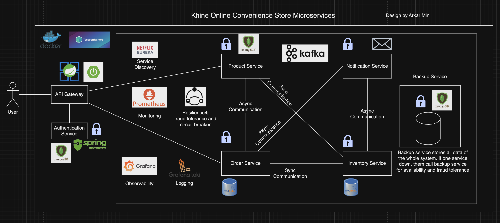

# Khine Online Convenience Store Microservices Architecture

This is the comprehensive **Microservices Architecture** that implements with Spring boot 3 and other tools. This project also can be reference for starter who start working with spring boot or want to build microservices with spring ecosystem. This project contains all microservices components and apply best practices as possible.

## Motivation

When I started learn with Spring, Spring Boot and Microservices, I cannot find any comprehensive guidelines or tutorials about what I want to lean. I only found pieces of information for single topics like api gateways or observability like that or maybe I did not do search thoroughly. So, I decided to bound these separated pieces into one big piece other say single place that contain all information with latest tech and tools. That why I built this project for all level of developer that can make reference. Maybe I did not implement the best practices for some aspect because I am myself still a learner not an expertise. In that case, please consider to give feedback or contribute in this project.  

## Tech Stack

- Spring framework + Spring Boot 3
- MySQL 
- MongoDB
- Docker
- Grafana
- Loki
- Tempo
- Prometheus
- Netflix Eureka
- Apache Kafka
- Resilience4j
- Testcontainers
- MailTrap

## Features

- Microservices
- JWT authentication
- Monitoring
- Logging
- Messaging
- Backup Plan

## High-level System design diagram

